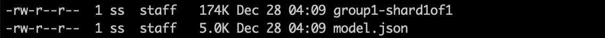
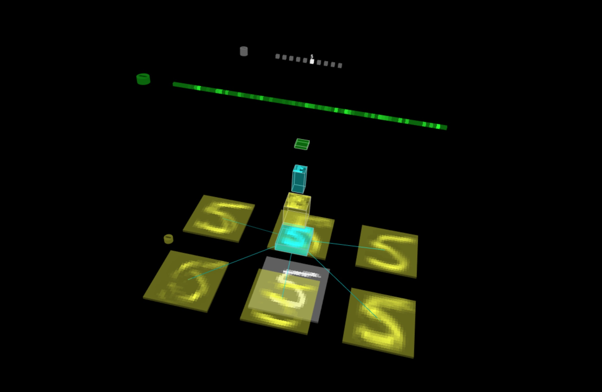

<p align="center">

</p>
<h1 align=center>Keras</h1>
<p align=center><b>Visualize pre-trained Keras model using TensorSpace and TensorSpace-Converter</b></p>

## Introduction

In the following chapter, we will introduce the usage and workflow of visualizing Keras model using TensorSpace and TensorSpace-Converter. In this tutorial, we will convert Keras models with TensorSpace-Converter and visualize the converted models with TensorSpace.

This example uses LeNet trained with MNIST dataset. If you do not have any existed model in hands, you can use this <a href="https://github.com/tensorspace-team/tensorspace-converter/tree/master/examples/keras/train/mnist.py">script</a> to train a LeNet TensorFlow.js model. We also provide [pre-trained Keras LeNet models](https://github.com/tensorspace-team/tensorspace-converter/tree/master/examples/keras/rawModel) for this example.

## Sample files

The sample files that are used in this tutorial are listed below:

* pre-trained [Keras models](https://github.com/tensorspace-team/tensorspace-converter/tree/master/examples/keras/rawModel)
* [TensorSpace-Converter preprocess script](https://github.com/tensorspace-team/tensorspace-converter/blob/master/examples/keras/script)
* [TensorSpace visualization code](https://github.com/tensorspace-team/tensorspace-converter/blob/master/examples/keras/index.html)

## Preprocess

First we will use TensorSpace-Converter to preprocess pre-trained different formats of Keras models.

### Combined .h5

* For a Keras model, topology and weights may be saved in a single HDF5 file, i.e. `xxx.h5`. Use the following convert script:

```shell
$ tensorspacejs_converter \
    --input_model_from="keras" \
    --input_model_format="topology_weights_combined" \
    --output_node_names="Conv2D_1,MaxPooling2D_1,Conv2D_2,MaxPooling2D_2,Dense_1,Dense_2,Softmax" \
    ./rawModel/combined/mnist.h5 \
    ./convertedModel/
```

**Note:**

* Set `input_model_from` to be `keras`.
* Set `input_model_format` to be `topology_weights_combined`.
* Set `.h5` file's path to positional argument `input_path`.
* Get out the `Keras layer names` of model, and set to `output_layer_names` like `Fig. 1`.
* TensorSpace-Converter will generate preprocessed model into `convertedModel` folder, for tutorial propose, we have already generated a model which can be found in [this folder](https://github.com/tensorspace-team/tensorspace-converter/tree/master/examples/keras/convertedModel).

### Separated .json & .h5

* For a Keras model, topology and weights may be saved in separated files, i.e. a topology file `xxx.json` and a weights file `eee.h5`. Use the following convert script:

```shell
$ tensorspacejs_converter \
    --input_model_from="keras" \
    --input_model_format="topology_weights_separated" \
    --output_node_names="Conv2D_1,MaxPooling2D_1,Conv2D_2,MaxPooling2D_2,Dense_1,Dense_2,Softmax" \
    ./rawModel/separated/topology.json,./rawModel/separated/weight.h5 \
    ./convertedModel/
```

**Note:**

* Set `input_model_from` to be `keras`.
* Set `input_model_format` to be `topology_weights_separated`.
* In this case, the model have two input files, merge two file's paths and separate them with comma (`.json` first, `.h5` last), and then set the combined path to positional argument `input_path`.
* Get out the `Keras layer names` of model, and set to `output_layer_names` like `Fig. 1`.
* TensorSpace-Converter will generate preprocessed model into `convertedModel` folder, for tutorial propose, we have already generated a model which can be found in [this folder](https://github.com/tensorspace-team/tensorspace-converter/tree/master/examples/keras/convertedModel).

<p align="center">

<br/>
<b>Fig. 1</b> - Set Keras layer names to output_layer_names
</p>

After converting, we shall have the following preprocessed model:
<p align="center">

<br/>
<b>Fig. 2</b> - Preprocessed Keras model
</p>

**Note:**

* There are two types of files created:
  * One `model.json` file,  describe the structure of our model (defined multiple outputs).
  * Some weight files which contains trained weights. The number of weight files is dependent on the size and structure of the given model.

## Load and Visualize

Then Apply TensorSpace API to construct visualization model.
```javascript
let model = new TSP.models.Sequential( modelContainer );

model.add( new TSP.layers.GreyscaleInput() );
model.add( new TSP.layers.Conv2d() );
model.add( new TSP.layers.Pooling2d() );
model.add( new TSP.layers.Conv2d() );
model.add( new TSP.layers.Pooling2d() );
model.add( new TSP.layers.Dense() );
model.add( new TSP.layers.Dense() );
model.add( new TSP.layers.Output1d( {
    outputs: [ "0", "1", "2", "3", "4", "5", "6", "7", "8", "9" ]
} ) );
```

Load the model generated by TensorSpace-Converter and then initialize the TensorSpace visualization model:
```javascript
model.load( {
    type: "keras",
    url: "./convertedModel/model.json"
} );

model.init();
```

## Result

If everything goes well, open the `index.html` file in browser, the model will display in the browser:
<p align="center">

<br/>
<b>Fig. 3</b> - TensorSpace LeNet with prediction data "5"
</p>