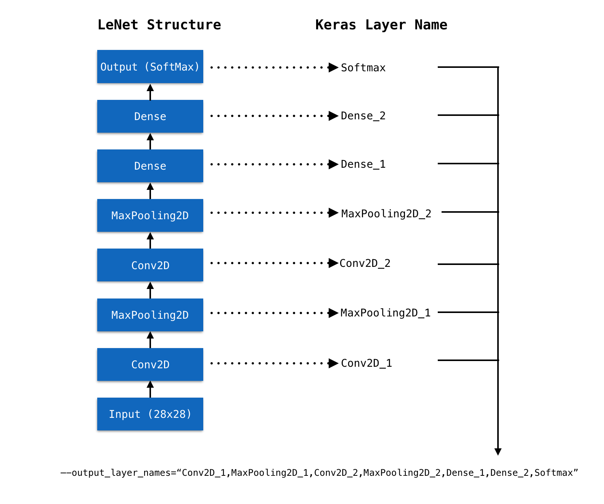

<p align="center">

</p>
<h1 align=center>Keras</h1>
<p align=center><b>使用 TensorSpace 和 TensorSpace-Converter 可视化 Keras 模型</b></p>

## 简介

本教程展示如何使用 TensorSpace 和 TensorSpace-Converter 可视化 Keras 模型。在接下来的教程中，可视化使用 MNIST 数据集和 LeNet 神经网络结构 构建的 Keras 模型。

若果您并没有任何可以直接使用的 `Keras` 模型，可以使用 [这个](https://github.com/tensorspace-team/tensorspace-converter/tree/master/examples/keras/train/mnist.py) 脚本训练一个新的样例模型。当然，我们也提供了训练好的 `LeNet` 模型，在可以直接从 [这里](https://github.com/tensorspace-team/tensorspace-converter/tree/master/examples/keras/rawModel) 获得。

## 文件

以下为本篇教程所使用的代码及模型文件:

* [Keras 模型](https://github.com/tensorspace-team/tensorspace-converter/tree/master/examples/keras/rawModel)
* [TensorSpace-Converter 预处理脚本](https://github.com/tensorspace-team/tensorspace-converter/blob/master/examples/keras/script)
* [TensorSpace 可视化代码](https://github.com/tensorspace-team/tensorspace-converter/blob/master/examples/keras/index.html)

## 预处理

首先我们将会使用 TensorSpace-Converter 对不同格式的 `Keras` 模型进行预处理。

### 模型结构和权重保存在一个HDF5文件

对于一个 Keras 模型，如果模型结构和权重保存在同一个 HDF5 文件中，模型将会是 `xxx.h5`。可以使用以下 TensorSpace-Converter 脚本进行转化：

```shell
$ tensorspacejs_converter \
    --input_model_from="keras" \
    --input_model_format="topology_weights_combined" \
    --output_node_names="Conv2D_1,MaxPooling2D_1,Conv2D_2,MaxPooling2D_2,Dense_1,Dense_2,Softmax" \
    ./rawModel/combined/mnist.h5 \
    ./convertedModel/
```

**❗ 注意:** 

* 将 `input_model_from` 设置成 `keras`。
* 将 `input_model_format` 设置成 `topology_weights_combined`。
* 将 `.h5` 文件的路径设置到 `input_path` 中。
* 取出 `Keras` 模型的 `Layer` 名称, 然后设置到 `output_layer_names` 中，如 `图1` 所示。
* 以上 TensorSpace-Converter 预处理脚本将会在 `convertedModel` 文件夹中生成经过预处理的模型。在本教程中，我们已经生成了经过预处理的模型，模型文件可以在 [这个文件夹](https://github.com/tensorspace-team/tensorspace-converter/tree/master/examples/keras/convertedModel) 中找到。

### 模型结构和权重保存在不同的文件中

对于一个 Keras 模型，如果模型结构和权重分开保存，那么会有一个模型结构文件 `xxx.json` 和一个模型权重文件 `eee.h5`。可以使用以下 TensorSpace-Converter 脚本进行转化：

```shell
$ tensorspacejs_converter \
    --input_model_from="keras" \
    --input_model_format="topology_weights_separated" \
    --output_node_names="Conv2D_1,MaxPooling2D_1,Conv2D_2,MaxPooling2D_2,Dense_1,Dense_2,Softmax" \
    ./rawModel/separated/topology.json,./rawModel/separated/weight.h5 \
    ./convertedModel/
```

**❗ 注意:** 

* 将 `input_model_from` 设置成 `keras`。
* 将 `input_model_format` 设置成 `topology_weights_separated`.
* 对于这种模型类型，因为有两个模型文件，在设置 `TensorSpace-Converter` 的 `input_path` 时，合并两个文件的路径，并用英文半角逗号“,”分开，将 `.json` 文件的路径在前，`.h5` 文件的路径在后。
* 取出 `Keras` 模型的 `Layer` 名称, 然后设置到 `output_layer_names` 中，如 `图1` 所示。
* 以上 TensorSpace-Converter 预处理脚本将会在 `convertedModel` 文件夹中生成经过预处理的模型。在本教程中，我们已经生成了经过预处理的模型，模型文件可以在 [这个文件夹](https://github.com/tensorspace-team/tensorspace-converter/tree/master/examples/keras/convertedModel) 中找到。


<p align="center">

<br/>
<b>图1</b> - 将 Keras 模型 Layer 名取出并设置 output_layer_names
</p>

经过转化后，我们将会得到经过预处理的模型：
<p align="center">

<br/>
<b>图2</b> - 经过预处理的 Keras 模型
</p>

**❗ 注意:** 

* 我们将会得到2种不同类型的文件：
    * 一份 `model.json` 文件：包含所得到的模型结构信息（包括中间层输出）。
    * 一些 `权重` 文件：包含模型训练所得到的权重信息。权重文件的数量取决于模型的结构。

## 载入并可视化

通过 TensorSpace API 构建 TensorSpace 可视化模型。
```javascript
let model = new TSP.models.Sequential( modelContainer );

model.add( new TSP.layers.GreyscaleInput() );
model.add( new TSP.layers.Conv2d() );
model.add( new TSP.layers.Pooling2d() );
model.add( new TSP.layers.Conv2d() );
model.add( new TSP.layers.Pooling2d() );
model.add( new TSP.layers.Dense() );
model.add( new TSP.layers.Dense() );
model.add( new TSP.layers.Output1d( {
    outputs: [ "0", "1", "2", "3", "4", "5", "6", "7", "8", "9" ]
} ) );
```

载入经过 TensorSpace-Converter 预处理的模型，然后将模型进行初始化：
```javascript
model.load( {
    type: "keras",
    url: "./convertedModel/model.json"
} );

model.init();
```

## 结果显示

若至此一切顺利，在浏览器中打开 `index.html`，将会看到以下模型：
<p align="center">

<br/>
<b>图3</b> - TensorSpace LeNet 预测 "5"
</p>