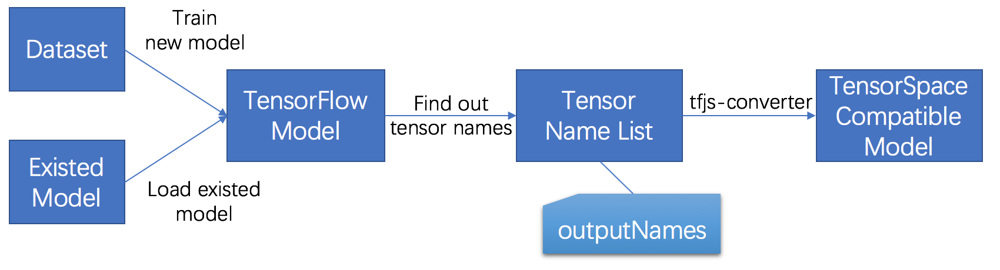

<p align="center">

</p>

## Preprocessing a TensorFlow Model

In the following chapter, we will introduce how to prepare a TensorFlow model (saved model, frozen model and checkpoint) before applying TensorSpace.

Here is the list of sample files we are using for the following tutorial:
* [tensorflow_create_model.py](https://github.com/syt123450/tensorspace/blob/master/docs/preprocess/TensorFlow/src_py/tensorflow_create_model.py)
* [tensorflow_load_model.py](https://github.com/syt123450/tensorspace/blob/master/docs/preprocess/TensorFlow/src_py/tensorflow_load_model.py)
* [tensorflow_conversion.py](https://github.com/syt123450/tensorspace/blob/master/docs/preprocess/TensorFlow/src_py/tensorflow_conversion.py)
* [convert_tensorflow_saved_model.sh](https://github.com/syt123450/tensorspace/blob/master/docs/preprocess/TensorFlow/src_sh/convert_tensorflow_saved_model.sh)
* [convert_tensorflow_frozen_model.sh](https://github.com/syt123450/tensorspace/blob/master/docs/preprocess/TensorFlow/src_sh/convert_tensorflow_frozen_model.sh)
* [all model files](https://github.com/syt123450/tensorspace/tree/master/docs/preprocess/TensorFlow/models)

For the tutorial, we use Python 3.6.5 and the following libraries:
```Python
import tensorflow as tf
import numpy as np
from tensorflow.contrib.layers import flatten
from sklearn.utils import shuffle
mnist = tf.keras.datasets.mnist
```
**Note:**
* The core libraries are `tensorflow` and `numpy`.
* `tf.keras` is used to provide dataset only.
* `sklearn.utils` is used for `shuffle` only.

It is also required to install [tfjs-converter](https://github.com/tensorflow/tfjs-converter) (it is a tool from TensorFlow.js):
```shell
$ pip install tensorflowjs
```

In general, the preprocess of a TensorFlow model is:

<p align="center" verticle-align="center">

<br/>
<b>Fig. 1</b> - Steps to preprocess a TensorFlow model
</p>

* [1 Train/Load a model](#loadModel)
* [2 Find out tensor names](#findNames)
* [3 Convert to TensorSpace compatible Model](#convertModel)

It is different from the preprocessing of a Keras or tf.Keras model: we don't need to encapsulate an intermediate TensorFlow model. All we want is to catch the correct corresponding **tensor names** and convert original model to TensorSpace compatible model directly by tfjs-converter.

**Note:**
* The collected tensor names are stored as a list which is used as **"outputNames"** in the TensorSpace.

### <div id="loadModel">1 Train/Load Model</div>
#### 1.1 Train a Model
If you do not have start to construct any model, let's build a LeNet by TensorFlow together~

We use the LeNet with MNIST dataset as an example for the process, which is similar to the construction from [sujaybabruwad/LeNet-in-Tensorflow](https://github.com/sujaybabruwad/LeNet-in-Tensorflow)

First we have to reshape the input dataset to the required size:
```Python
# Raw input & normalization
(x_train, y_train),(x_test, y_test) = mnist.load_data()
x_train, x_test = x_train / 255.0, x_test / 255.0

# Match dimensions
x_train = x_train.reshape((-1, 28, 28, 1)).astype(np.float32)
x_test = x_test.reshape((-1, 28, 28, 1)).astype(np.float32)

# Add padding to 32x32
x_train = np.pad(x_train, ((0,0), (2,2), (2,2), (0,0)), 'constant')
x_test = np.pad(x_test, ((0,0), (2,2), (2,2), (0,0)), 'constant')
```

Next, based on the structure of an LeNet_v5:
<p align="center">

<br/>
<b>Fig. 2</b> - LeNet structure
</p>

we should have 2 Conv2D+MaxPooling together with 3 dense layers. The model is implemented like:
```Python
def LeNet_5(x):
    # Convolutional Layer. Input = 32x32x1, Output = 28x28x1.
    conv1_w = tf.Variable(
        tf.truncated_normal(
            shape=[5, 5, 1, 6], mean=0, stddev=0.1))
    conv1_b = tf.Variable(tf.zeros(6))
    conv1 = tf.nn.conv2d(
        x, conv1_w, strides=[1, 1, 1, 1], padding='VALID') + conv1_b
    conv1 = tf.nn.relu(conv1, name="MyConv2D_1")

    # Pooling Layer. Input = 28x28x1. Output = 14x14x6.
    pool_1 = tf.nn.max_pool(
        conv1, ksize=[1, 2, 2, 1], 
        strides=[1, 2, 2, 1], padding='VALID', 
        name="MyMaxPooling2D_1")

    # Convolutional. Output = 10x10x16.
    conv2_w = tf.Variable(
        tf.truncated_normal(
            shape=[5, 5, 6, 16], mean=0, stddev=0.1))
    conv2_b = tf.Variable(tf.zeros(16))
    conv2 = tf.nn.conv2d(
        pool_1, conv2_w, strides=[1, 1, 1, 1], padding='VALID') + conv2_b
    conv2 = tf.nn.relu(conv2, name="MyConv2D_2")

    # Pooling. Input = 10x10x16. Output = 5x5x16.
    pool_2 = tf.nn.max_pool(
        conv2, ksize=[1, 2, 2, 1], 
        strides=[1, 2, 2, 1], padding='VALID', 
        name="MyMaxPooling2D_2")

    # Flatten. Input = 5x5x16. Output = 400.
    fc1 = flatten(pool_2)

    # Fully Connected. Input = 400. Output = 120.
    fc1_w = tf.Variable(
        tf.truncated_normal(
            shape=(400, 120), mean=0, stddev=0.1))
    fc1_b = tf.Variable(tf.zeros(120))
    fc1 = tf.matmul(fc1, fc1_w) + fc1_b

    # Activation.
    fc1 = tf.nn.relu(fc1, name="MyDense_1")

    # Fully Connected. Input = 120. Output = 84.
    fc2_w = tf.Variable(
        tf.truncated_normal(
            shape=(120, 84), mean=0, stddev=0.1))
    fc2_b = tf.Variable(tf.zeros(84))
    fc2 = tf.matmul(fc1, fc2_w) + fc2_b
    # Activation.
    fc2 = tf.nn.relu(fc2, name="MyDense_2")

    # Fully Connected. Input = 84. Output = 10.
    fc3_w = tf.Variable(
        tf.truncated_normal(
            shape=(84, 10), mean=0, stddev=0.1))
    fc3_b = tf.Variable(tf.zeros(10))
    logits = tf.matmul(fc2, fc3_w) + fc3_b
    return logits
``` 
**Note:**
* We put a **"name"** property for the tensor that we want to apply TensorSpace later. A specified name can speed up the process of creating **"outputNames"** list.
* You may notice that we do not mark the tensor exactly in the tensor for the core action. For example, we don't put a name in the `tf.nn.conv2d`, but mark `tf.nn.relu` as the **"MyConv2D_*"**. The reason is that our desired output of a "Convolution Layer" is the result of the activation function, which provides a better visualization.
* We only have 2 dense (or fully connection) tensors in the function. The last Softmax dense will be used for training, so we treat it a little different.

After building up the structure, let's train the model:
```Python
x = tf.placeholder(tf.float32, shape=[None,32,32,1],name="MyInput")
y = tf.placeholder(tf.int32, (None), name="y")
one_hot_y = tf.one_hot(y, 10)

#Invoke LeNet function by passing features
logits = LeNet_5(x)

# All kinds different operations
#Softmax with cost function implementation
cross_entropy \
    = tf.nn.softmax_cross_entropy_with_logits_v2(labels=one_hot_y, logits=logits)
loss_operation = tf.reduce_mean(cross_entropy)

optimizer = tf.train.AdamOptimizer(learning_rate=0.001)
training_operation = optimizer.minimize(loss_operation)

correct_prediction = tf.equal(tf.argmax(logits, 1), tf.argmax(one_hot_y, 1))
accuracy_operation = tf.reduce_mean(tf.cast(correct_prediction, tf.float32))

# Declare an actual output without training label dependence
predict_outputs = tf.nn.softmax(logits, name="MySoftMax")

EPOCHS = 5
BATCH_SIZE = 128

# Evaluate function
def evaluate(X_data, y_data):
    num_examples = len(X_data)
    total_accuracy = 0
    sess = tf.get_default_session()
    for offset in range(0, num_examples, BATCH_SIZE):
        batch_x, batch_y \
            = X_data[offset:offset + BATCH_SIZE]\
            , y_data[offset:offset + BATCH_SIZE]
        accuracy = sess.run(accuracy_operation, feed_dict={x: batch_x, y: batch_y})
        total_accuracy += (accuracy * len(batch_x))
    return total_accuracy / num_examples

with tf.Session() as sess:
    sess.run(tf.global_variables_initializer())
    num_examples = len(x_train)

    print("Training... with dataset - ", num_examples)
    print()
    for i in range(EPOCHS):
        x_train, y_train = shuffle(x_train, y_train)
        for offset in range(0, num_examples, BATCH_SIZE):
            end = offset + BATCH_SIZE
            batch_x, batch_y = x_train[offset:end], y_train[offset:end]
            sess.run(training_operation, feed_dict={x: batch_x, y: batch_y})

        validation_accuracy = evaluate(x_test, y_test)
        print("EPOCH {} ...".format(i + 1))
        print("Validation Accuracy = {:.3f}".format(validation_accuracy))
        print()

    test_accuracy = evaluate(x_test, y_test)
    print("Test Accuracy = {:.3f}".format(test_accuracy))
``` 

**Note:**
* Don't forget to declare an extra Softmax tensor for the prediction output and give a proper **"name"**.

We can see some evaluation outputs like:

<p align="center">

<br/>
<b>Fig. 3</b> - Training evaluations
</p>

#### 1.2 Load a Model
If you have already had a tensorflow model trained in hand, let's try to load the model.

We can load the model from a saved model, frozen model or a checkpoint:
```Python
with tf.Session(graph=tf.Graph()) as sess:
    tf.saved_model.loader.load(
        sess,
        [tag_constants.SERVING],
        '../models/tensorflow_model',
    )
``` 
```Python
with tf.Session() as sess:
    model_filename ='/PATH/TO/PB/model.pb'
    with gfile.FastGFile(model_filename, 'rb') as f:
        graph_def = tf.GraphDef()
        graph_def.ParseFromString(f.read())
        g_in = tf.import_graph_def(graph_def)
``` 
```Python
with tf.Session(graph=tf.Graph()) as sess:
    dir_path = '../DIR/SAVE/CKPT/'
    ckpt_name = 'lenet.ckpt'
    saver = tf.train.import_meta_graph(dir_path + ckpt_name + '.meta')
    saver.restore(sess, tf.train.latest_checkpoint(dir_path))
``` 

**Note:**
* If you are loading a model from Checkpoint, you have to dump the file to either SavedModel or FrozenModel. Since the tfjs-converter currently does not support the conversion from Checkpoint to TensorFlow.js compatible.
* You can try the conversion similar to:
```Python
with tf.Session(graph=tf.Graph()) as sess:
    dir_path = '../DIR/SAVE/CKPT/'
    ckpt_name = 'lenet.ckpt'
    saver = tf.train.import_meta_graph(dir_path + ckpt_name + '.meta')
    saver.restore(sess, tf.train.latest_checkpoint(dir_path))

    graph = tf.get_default_graph()

    # Pick input for SavedModel
    x = graph.get_tensor_by_name("input/Placeholder:0")
    # Pick output for SavedModel
    add_8 = graph.get_tensor_by_name("add_8:0")

    output_dir = '/OUTPUT/TO/DIR/'
    tf.saved_model.simple_save(
        sess, output_dir,
        {"input":x},
        {"output":add_8}
    )
``` 

### <div id="findNames">2 Find Out Tensor Names</div>
It is actually the key step of the preprocess. We have to find out proper tensor names for our model.

We can try to output all tensor names like:
```Python
for n in tf.get_default_graph().as_graph_def().node:
    print(n.name)
```
You may get a lot, even the model is not that large. From the model we just built, we have 400+ tensors:

<p align="center">

<br/>
<b>Fig. 4</b> - Tensor names
</p>

**Note:**
* Don't worry about every tensors, most of them are used as parameter or for training only. You only need to focus on the ones which are used for prediction.
* If you trained a model by providing **"name"** properties, you can find them all quickly in the list, which indicates everything follows expectations. 
* If you try to use an existed model, it may require some knowledge of the model structure.
* In most cases, if a tensor **"name"** is not specified while construction, it is related to the constructor of TensorFlow.

After we figured out the tensors we want, we have to put them in a name list:
```Python
output_names = ["MyConv2D_1", "MyMaxPooling2D_1", "MyConv2D_2", "MyMaxPooling2D_2",
                "MyDense_1", "MyDense_2", "MySoftMax"]
```

We can have a quick test for the tensors:
```Python
graph = tf.get_default_graph()
x = graph.get_tensor_by_name("MyInput:0")
outputs = list(map(lambda on: graph.get_tensor_by_name(on+":0"), output_names))
print(sess.run(outputs, feed_dict={x:x_test}))
```

<p align="center">

<br/>
<b>Fig. 5</b> - Multiple list outputs after preprocessing
</p>

<p align="center">

<br/>
<b>Fig. 6</b> - Last list is the original output
</p>

**Note:**
* You have to add **":0"** for the output from the tensor object. If not, it returns the tensor object (i.e. rise exceptions).
* Please save the **name list** which will be used as **outputNames** in TensorSpace.

### <div id="convertModel">3 Convert to TensorSpace compatible model</div>
If everything so far looks good, we can use the following script to dump out a TensorSpace compatable model:
```Bash
onn='MyConv2D_1,MyMaxPooling2D_1,MyConv2D_2,MyMaxPooling2D_2,MyDense_1,MyDense_2,MySoftMax'
tensorflowjs_converter \
    --input_format=tf_saved_model \
    --output_node_names=$onn \
    --saved_model_tags=serve \
    ../models/tensorflow_model \
    ../models/json_models/tensorflow
```

**Note:**
* Please make sure you have installed tfjs-converter correctly.
* If the model is a CheckPoint, you have to save it as a SavedModel or FrozenModel first, since the tfjs-converter does not support Checkpoint for now.
* Select the `input_format` based on your model type.
* Put name list as a parameter of the script (no extra space or quotes).

<p align="center">

<br/>
<b>Fig. 7</b> - Saved model files
</p>

**Note:**
* There are three types of file generated:
    * One "tensorflowjs_model.pb" file which describe the structure of the model.
    * One "weights_manifest.json" file which describe the weights manifest.
    * Some weight files which contains actual weight values. The number of weight files is dependent on the size and structure of the given model.
* For more detailed information about tfjs-converter, you can visit [here](https://github.com/tensorflow/tfjs-converter).

If everything looks good, you shall be ready for the next step - [Load a TensorSpace compatible model](http://tensorspace.org/html/docs/basicLoad.html).

