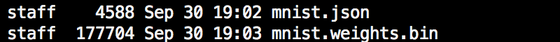
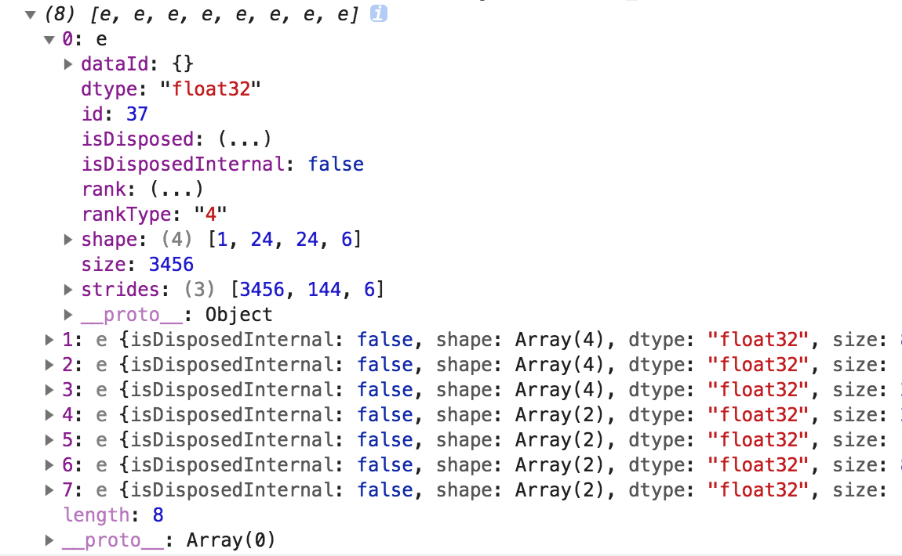

<p align="center">

</p>

## Preprocessing a TensorFlow.js Model

In the following chapter, we will introduce how to preprocess a TensorFlow.js (AKA. "tfjs") model before applying TensorSpace, which requires the intermediate outputs from internal layers.

If you are new for a tfjs model, we highly recommend you to go through the [guide](https://js.tensorflow.org/tutorials/) from TensorFlow.js first.

The sample files we used in the tutorial are listed below:
* [createTfjsModel.html](https://github.com/tensorspace-team/tensorspace/blob/master/docs/preprocess/TensorFlowJS/src_html/createTfjsModel.html)
* [loadTfjsModel.html](https://github.com/tensorspace-team/tensorspace/blob/master/docs/preprocess/TensorFlowJS/src_html/loadTfjsModel.html)
* [all model files](https://github.com/tensorspace-team/tensorspace/tree/master/docs/preprocess/TensorFlowjs/models)

For the tutorial, make sure to install and import TensorFlow.js.

To install TensorFlow.js, just use the NPM install:
```bash
npm install @tensorflow/tfjs
```

To import TensorFlow.js, include tf.min.js in html.
```html
<script src="libs/tf.min.js"></script>
```
 

 
For preprocessing a tfjs model, we have a general process like:
<p align="center">

<br/>
<b>Fig. 1</b> - Steps to preprocess a TensorFlow.js model
</p>

In this tutorial, we will introduce the process in two use cases:
* [1. To train a TensorSpace compatible tfjs model](#trainModel)
* [2. To convert an existing tfjs model to make it compatible with TensorSpace](#loadModel)

All cases use LeNet with MNIST dataset as an example.

### <div id="trainModel">1 To train a TensorSpace compatible tfjs model</div>
#### 1.1 Train a new model
If you do not have any existed model in hands, let's train a TensorFlow.js model together.

First, let's take a look at the LeNet structure:

<p align="center">

<br/>
<b>Fig. 2</b> - LeNet structure
</p>

By following the structure, we can build a basic model:
```html

// Initialize layer.
const input = tf.input({shape: [28, 28, 1]});
const conv1 = tf.layers.conv2d({
    kernelSize: 5,
    filters: 6,
    strides: 1,
    activation: 'relu',
    kernelInitializer: 'VarianceScaling',
    name: 'MyConv2D_1'
});
const maxPool1 = tf.layers.maxPooling2d({
    poolSize: [2, 2],
    strides: [2, 2],
    name: 'MyMaxPooling_1'
});
const conv2 = tf.layers.conv2d({
    kernelSize: 5,
    filters: 16,
    strides: 1,
    activation: 'relu',
    kernelInitializer: 'VarianceScaling',
    name: 'MyConv2D_2'
});
const maxPool2 = tf.layers.maxPooling2d({
    poolSize: [2, 2],
    strides: [2, 2],
    name: 'MyMaxPooling_2'
});

const flatten = tf.layers.flatten();

const dense1 = tf.layers.dense({
    units: 120,
    kernelInitializer: 'VarianceScaling',
    activation: 'relu',
    name: 'MyDense_1'
});
const dense2 = tf.layers.dense({
    units: 84,
    kernelInitializer: 'VarianceScaling',
    activation: 'relu',
    name: 'MyDense_2'
});
const softmaxLayer = tf.layers.dense({
    units: 10,
    kernelInitializer: 'VarianceScaling',
    activation: 'softmax',
    name: 'MySoftMax'
});

// Make layer connection.
const conv1Output = conv1.apply(input);
const maxPool1Output = maxPool1.apply(conv1Output);
const conv2Output = conv2.apply(maxPool1Output);
const maxPool2Output = maxPool2.apply(conv2Output);
const flattenOutput = flatten.apply(maxPool2Output);
const dense1Output = dense1.apply(flattenOutput);
const dense2Output = dense2.apply(dense1Output);
const softMaxOutput = softmaxLayer.apply(dense2Output);

// For multiple outputs purpose, we use function tf.model API to build the model.
const model = tf.model({
    inputs: input,
    outputs: softMaxOutput
});


```

**Note:**
* Because of the limitations of TensorFlow.js library, we have to use the traditional `tf.model()` and `layer.apply()` techniques to construct the model. All layer output objects will be used later for the multiple outputs of the encapsulated model.
* If you build the model by `tf.sequential()`, you probably want to check [2. To convert an existing tfjs model to make it compatible with TensorSpace](#loadModel).

After creating the model, we can load the data, compile the model and train it: (The training script is modified from tfjs's [official tutorial](https://js.tensorflow.org/tutorials/mnist.html))
```html
const LEARNING_RATE = 0.0001;
const optimizer = tf.train.adam(LEARNING_RATE);

model.compile({
    optimizer: optimizer,
    loss: 'categoricalCrossentropy',
    metrics: ['accuracy'],
});

let data;
async function load() {
    data = new MnistData();
    await data.load();
}

async function train() {

    const BATCH_SIZE = 50;
    const TRAIN_BATCHES = 2;

    const TEST_BATCH_SIZE = 1000;
    const TEST_ITERATION_FREQUENCY = 100;

    for (let i = 0; i < TRAIN_BATCHES; i++) {
        const batch = data.nextTrainBatch(BATCH_SIZE);

        let testBatch;
        let validationData;

        if (i % TEST_ITERATION_FREQUENCY === 0) {
            testBatch = data.nextTestBatch(TEST_BATCH_SIZE);
            validationData = [
                testBatch.xs.reshape(
                    [TEST_BATCH_SIZE, 28, 28, 1]
                ), 
                testBatch.labels
            ];
        }

        const history = await model.fit(
            batch.xs.reshape([BATCH_SIZE, 28, 28, 1]),
            batch.labels,
            {
                batchSize: BATCH_SIZE,
                validationData,
                epochs: 1
            });

        if (i % TEST_ITERATION_FREQUENCY === 0) {
            const loss = history.history.loss[0];
            const accuracy = history.history.acc[0];

            console.log(accuracy);
        }
    }
}


await load();
await train();

```
#### 1.2 Collect internal outputs from intermediate layers
Since we construct the model by applying the output from the previous layer, we can encapsulate all or our desired layer outputs into a new model:
```html
const encModel = tf.model({
    inputs: input,
    outputs: [conv1Output, maxPool1Output, conv2Output, 
    maxPool2Output, dense1Output, dense2Output, softMaxOutput]
});
``` 

**Note:**
* We actually build two models:
  * `model` is the model which we train and evaluate following the common ML process.
  * `encModel` is the model with multiple intermediate outputs and will be saved later.
  
  
#### 1.3 Save the encapsulated model
Last, we can save our encapsulated model:
```html
async function saveModel() {
    await encModel.save("downloads://YOUR_MODEL_NAME");
}
``` 

**Note:**
* `downloads://` means to download from the browser.
* There are two types of files created:
  * `.json` is for the model structure
  * `.bin` is the trained weights
* Checkout [tf.Model.save](https://js.tensorflow.org/api/0.13.0/#tf.Model.save) for more information.
* For other save method, please checkout the official [guide](https://js.tensorflow.org/tutorials/model-save-load.html).

After downloading from the browser, we shall have the following files:

<p align="center">

<br/>
<b>Fig. 3</b> - Saved model files
</p>

### <div id="loadModel">2 To convert an existing tfjs model to make it compatible with TensorSpace</div>
#### 2.1 Load an existing model
To load an existing tfjs model, just simply load like:
```html
const loadedModel = await tf.loadModel('/PATH_TO_MODEL_JSON/model.json');
```

#### 2.2 Collect internal outputs from intermediate layers 
All we want from the model is to collect the internal outputs from intermediate layers. We can collect the output from each desired layer: 
```html
// Hard code the input if you are sure about the shape
// const input = tf.input({shape: [28, 28, 1]});
const input = ((typeof loadedModel === 'undefined') ? layers[0].input : loadedModel.input);

let targetLayerNameList = ["MyConv2D_1","MyMaxPooling_1","MyConv2D_2","MyMaxPooling_2","MySoftMax"];
let outputList = [];
let tempInput = input;
let tempOutput = null;

for (i =0; i<layers.length; i++) {
    console.log("name: " + layers[i].name);
    tempOutput = layers[i].apply(tempInput);
    
    if (targetLayerNameList.indexOf(layers[i].name) >-1) {
        outputList.push(tempOutput);
    }
    tempInput = tempOutput;
}

console.log(outputList);
```


The console output shall be:

<p align="center">

<br/>
<b>Fig. 4</b> - Intermediate layer names and multiple outputs
</p>

**Note:**
* Because of the limitations of TensorFlow.js, we have to apply each layer to its corresponding input manually. 
* In our example, since the model structure is simple: a single workflow from start to the end, we just need to iterate every layer and set the layer output as the input for the next layer. However, if you have a complex structure, please double check the inputs the layer required.

Then, we can encapsulate the desired outputs into a new model with the same input as the original model:
```html
const encModel = tf.model({
    inputs: input,
    outputs: outputList
});

singleOutput = encModel.predict(tf.randomNormal([1,28,28,1]));
console.log(singleOutput);
```

<p align="center">

<br/>
<b>Fig. 5</b> - Multiple outputs from encapsulated model
</p>

#### 2.3 Save the encapsulated model 
After completing the previous steps, we can save the encapsulated model:
```html
async function saveModel() {
    await encModel.save("downloads://encModel");
}
saveModel();
```

If everything looks good, you shall be ready for the next step - [Load a TensorSpace compatible model](https://tensorspace.org/html/docs/basicLoad.html).
