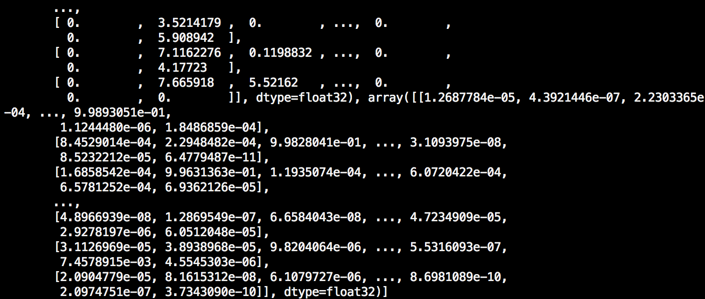

<p align="center">

</p>

# TensorFlow 模型预处理

本篇将介绍如何预处理基于 TensorFlow 搭建的神经网络模型 (saved model, frozen model and checkpoint)，以此来适配 TensorSpace 所需要的拥有中间层输出的模型。

本篇教程所使用的代码及模型源文件列表：
* [tensorflow_create_model.py](https://github.com/tensorspace-team/tensorspace/blob/master/docs/preprocess/TensorFlow/src_py/tensorflow_create_model.py)
* [tensorflow_load_model.py](https://github.com/tensorspace-team/tensorspace/blob/master/docs/preprocess/TensorFlow/src_py/tensorflow_load_model.py)
* [tensorflow_conversion.py](https://github.com/tensorspace-team/tensorspace/blob/master/docs/preprocess/TensorFlow/src_py/tensorflow_conversion.py)
* [convert_tensorflow_saved_model.sh](https://github.com/tensorspace-team/tensorspace/blob/master/docs/preprocess/TensorFlow/src_sh/convert_tensorflow_saved_model.sh)
* [convert_tensorflow_frozen_model.sh](https://github.com/tensorspace-team/tensorspace/blob/master/docs/preprocess/TensorFlow/src_sh/convert_tensorflow_frozen_model.sh)
* [模型](https://github.com/tensorspace-team/tensorspace/tree/master/docs/preprocess/TensorFlow/models)

运行环境：Python 3.6.5。相关依赖如下：
```Python
import tensorflow as tf
import numpy as np
from tensorflow.contrib.layers import flatten
from sklearn.utils import shuffle
mnist = tf.keras.datasets.mnist
```
**❗ 注意**
* `tensorflow` 与 `numpy` 为核心库。
* `tf.keras` 仅用来提供训练所需要的数据集
* `sklearn.utils` 只用于提供 `shuffle`。

此外，我们还需要安装 [tfjs-converter](https://github.com/tensorflow/tfjs-converter)(基于 TensorFlow.js 的转换工具):
```shell
$ pip install tensorflowjs
```

安装完成后，`tensorflowjs_converter` 变为系统可用关键字，可用下列命令来调用

```shell
$ tensorflowjs_converter \
    --input_format=tf_saved_model \
    --output_node_names=$onn \
    --saved_model_tags=serve \
    ../models/tensorflow_model \
    ../models/json_models/tensorflow
```

预处理 TensorFlow 模型大致上分为以下几个步骤：

<p align="center" verticle-align="center">

<br/>
<b>图1</b> - 预处理 TensorSpace 模型的步骤
</p>

* [1. 训练/加载模型](#loadModel)
* [2. 找出中间层 tensor 名称](#findNames)
* [3. 转换为 TensorSpace 适配的模型](#convertModel)

与预处理 Keras 和 tf.keras 模型不同的是，我们不需要额外生成包含中间层输出的`嵌入多输出模型`。我们只需要提取我们所需要的中间层 tensor 名称（**tensor names**），然后进行模型格式转换。

 **❗ 注意**

* 在 TensorSpace 中，所收集的 tensor 名称将保存于 **"outputNames"** 之中。

## <div id="loadModel">1 训练/加载模型</div>

### 1.1 训练模型

如果您目前还没有可以马上使用的 TensorFlow 模型，可以按照本小节的方法训练一个新的样例模型。

我们将使用 MNIST 数据集以及 LeNet 网络结构为例，使用 TensorFlow 构建一个神经网络模型。（参考 [sujaybabruwad/LeNet-in-Tensorflow](https://github.com/sujaybabruwad/LeNet-in-Tensorflow)）

#### 第一步，对训练数据进行预处理，改变训练数据的形状

〔源码〕[tensorflow_create_model.py](https://github.com/tensorspace-team/tensorspace/blob/master/docs/preprocess/TensorFlow/src_py/tensorflow_create_model.py#L7)

```Python
# Raw input & normalization
(x_train, y_train),(x_test, y_test) = mnist.load_data()
x_train, x_test = x_train / 255.0, x_test / 255.0

# Match dimensions
x_train = x_train.reshape((-1, 28, 28, 1)).astype(np.float32)
x_test = x_test.reshape((-1, 28, 28, 1)).astype(np.float32)

# Add padding to 32x32
x_train = np.pad(x_train, ((0,0), (2,2), (2,2), (0,0)), 'constant')
x_test = np.pad(x_test, ((0,0), (2,2), (2,2), (0,0)), 'constant')
```

#### 第二步，根据 LeNet_v5 的网络结构来构建模型

<p align="center">

<br/>
<b>图2</b> - LeNet 网络结构
</p>

网络包括：2个 Conv2D + MaxPooling 的组合，紧接着3层 Dense。

〔源码〕[tensorflow_create_model.py](https://github.com/tensorspace-team/tensorspace/blob/master/docs/preprocess/TensorFlow/src_py/tensorflow_create_model.py#L30)

```Python
def LeNet_5(x):
    # Convolutional Layer. Input = 32x32x1, Output = 28x28x1.
    conv1_w = tf.Variable(
        tf.truncated_normal(
            shape=[5, 5, 1, 6], mean=0, stddev=0.1))
    conv1_b = tf.Variable(tf.zeros(6))
    conv1 = tf.nn.conv2d(
        x, conv1_w, strides=[1, 1, 1, 1], padding='VALID') + conv1_b
    conv1 = tf.nn.relu(conv1, name="MyConv2D_1")

    # Pooling Layer. Input = 28x28x1. Output = 14x14x6.
    pool_1 = tf.nn.max_pool(
        conv1, ksize=[1, 2, 2, 1], 
        strides=[1, 2, 2, 1], padding='VALID', 
        name="MyMaxPooling2D_1")

    # Convolutional. Output = 10x10x16.
    conv2_w = tf.Variable(
        tf.truncated_normal(
            shape=[5, 5, 6, 16], mean=0, stddev=0.1))
    conv2_b = tf.Variable(tf.zeros(16))
    conv2 = tf.nn.conv2d(
        pool_1, conv2_w, strides=[1, 1, 1, 1], padding='VALID') + conv2_b
    conv2 = tf.nn.relu(conv2, name="MyConv2D_2")

    # Pooling. Input = 10x10x16. Output = 5x5x16.
    pool_2 = tf.nn.max_pool(
        conv2, ksize=[1, 2, 2, 1], 
        strides=[1, 2, 2, 1], padding='VALID', 
        name="MyMaxPooling2D_2")

    # Flatten. Input = 5x5x16. Output = 400.
    fc1 = flatten(pool_2)

    # Fully Connected. Input = 400. Output = 120.
    fc1_w = tf.Variable(
        tf.truncated_normal(
            shape=(400, 120), mean=0, stddev=0.1))
    fc1_b = tf.Variable(tf.zeros(120))
    fc1 = tf.matmul(fc1, fc1_w) + fc1_b

    # Activation.
    fc1 = tf.nn.relu(fc1, name="MyDense_1")

    # Fully Connected. Input = 120. Output = 84.
    fc2_w = tf.Variable(
        tf.truncated_normal(
            shape=(120, 84), mean=0, stddev=0.1))
    fc2_b = tf.Variable(tf.zeros(84))
    fc2 = tf.matmul(fc1, fc2_w) + fc2_b
    # Activation.
    fc2 = tf.nn.relu(fc2, name="MyDense_2")

    # Fully Connected. Input = 84. Output = 10.
    fc3_w = tf.Variable(
        tf.truncated_normal(
            shape=(84, 10), mean=0, stddev=0.1))
    fc3_b = tf.Variable(tf.zeros(10))
    logits = tf.matmul(fc2, fc3_w) + fc3_b
    return logits
```
**❗ 注意**

* **建议**对需要用 TensorSpace 3D可视化的层（tensor）添加 **"name"** 属性。这将为我们之后寻找指定 tensor 、生成 **"outputNames"** 的过程提供极大的便利。
* 您可能注意到了：我们并没有将“正确的”名称添加到“正确的” tensor 内。例如：我们没有为 `tf.nn.conv2d` 标记名称为 **"MyConv2D_*"** 。我们将 `tf.nn.relu` 标记为 **"MyConv2D_*"** 。这取决于你需要哪一层的层间数据：若你希望获得卷积层后的数据，就对 `tf.nn.conv2d` 命名；若将卷积层和激励函数看成一个整体，就在`tf.nn.relu`后添加名称。选择不同的命名方法可能会对所呈现的可视化效果产生不同的影响。
* 我们只添加了两层 Dense。因为最后的一层 Softmax Dense 将用于之后的训练，所以我们会对其进行不同的处理。

#### 第三步，训练模型

〔源码〕[tensorflow_create_model.py](https://github.com/tensorspace-team/tensorspace/blob/d4392e17527e1be495fa94cd70b6a651e2aaac6b/docs/preprocess/TensorFlow/src_py/tensorflow_create_model.py#L92)

```Python
x = tf.placeholder(tf.float32, shape=[None,32,32,1],name="MyInput")
y = tf.placeholder(tf.int32, (None), name="y")
one_hot_y = tf.one_hot(y, 10)

#Invoke LeNet function by passing features
logits = LeNet_5(x)

# All kinds different operations
#Softmax with cost function implementation
cross_entropy \
    = tf.nn.softmax_cross_entropy_with_logits_v2(labels=one_hot_y, logits=logits)
loss_operation = tf.reduce_mean(cross_entropy)

optimizer = tf.train.AdamOptimizer(learning_rate=0.001)
training_operation = optimizer.minimize(loss_operation)

correct_prediction = tf.equal(tf.argmax(logits, 1), tf.argmax(one_hot_y, 1))
accuracy_operation = tf.reduce_mean(tf.cast(correct_prediction, tf.float32))

# Declare an actual output without training label dependence
predict_outputs = tf.nn.softmax(logits, name="MySoftMax")

EPOCHS = 5
BATCH_SIZE = 128

# Evaluate function
def evaluate(X_data, y_data):
    num_examples = len(X_data)
    total_accuracy = 0
    sess = tf.get_default_session()
    for offset in range(0, num_examples, BATCH_SIZE):
        batch_x, batch_y \
            = X_data[offset:offset + BATCH_SIZE]\
            , y_data[offset:offset + BATCH_SIZE]
        accuracy = sess.run(accuracy_operation, feed_dict={x: batch_x, y: batch_y})
        total_accuracy += (accuracy * len(batch_x))
    return total_accuracy / num_examples

with tf.Session() as sess:
    sess.run(tf.global_variables_initializer())
    num_examples = len(x_train)

    print("Training... with dataset - ", num_examples)
    print()
    for i in range(EPOCHS):
        x_train, y_train = shuffle(x_train, y_train)
        for offset in range(0, num_examples, BATCH_SIZE):
            end = offset + BATCH_SIZE
            batch_x, batch_y = x_train[offset:end], y_train[offset:end]
            sess.run(training_operation, feed_dict={x: batch_x, y: batch_y})

        validation_accuracy = evaluate(x_test, y_test)
        print("EPOCH {} ...".format(i + 1))
        print("Validation Accuracy = {:.3f}".format(validation_accuracy))
        print()

    test_accuracy = evaluate(x_test, y_test)
    print("Test Accuracy = {:.3f}".format(test_accuracy))
```

**❗ 注意**

* 我们需要在外部额外声明一个 Softmax tensor 并添加一个合适的名称（**"name"**），以用于提取预测的最终结果。

下图是训练结果后的输出：

<p align="center">

<br/>
<b>图3</b> - 训练分析
</p>

### 1.2 加载一个模型

已有预训练模型，直接加载。Tensorflow有三种常见的预训练模型，[点击链接查看模型类别详情](https://cloud.tencent.com/developer/article/1009979) 

〔源码〕[tensorflow_load_model.py](https://github.com/tensorspace-team/tensorspace/blob/master/docs/preprocess/TensorFlow/src_py/tensorflow_load_model.py)

- `saved model`：一个`.pb`文件，并有一个`variables`文件夹，可能含有`assets`文件夹。部署时使用此格式

```Python
with tf.Session(graph=tf.Graph()) as sess:
    tf.saved_model.loader.load(
        sess,
        [tag_constants.SERVING],
        '../models/tensorflow_model',
    )
```

- `frozen model`：又被称为`FrozenGraphDef`格式，`.pb`文件。多用于移动端模型

```Python
with tf.Session() as sess:
    model_filename ='/PATH/TO/PB/model.pb'
    with gfile.FastGFile(model_filename, 'rb') as f:
        graph_def = tf.GraphDef()
        graph_def.ParseFromString(f.read())
        g_in = tf.import_graph_def(graph_def)
```

- `checkpoint`：含有`checkpoint`文件，文件命名含有关键字`ckpt`。信息完整，可用于迁移训练

```Python
with tf.Session(graph=tf.Graph()) as sess:
    dir_path = '../DIR/SAVE/CKPT/'
    ckpt_name = 'lenet.ckpt'
    saver = tf.train.import_meta_graph(dir_path + ckpt_name + '.meta')
    saver.restore(sess, tf.train.latest_checkpoint(dir_path))
```

**❗ 注意**

* 如果需要加载 Checkpoint，需要将所加载的模型保存为 SavedModel 或者 FrozenModel 。因为 tfjs-converter 目前并不支持对于 Checkpoint 的转换适配。
* 如果需要转换 Checkpoint，运行以下代码段。〔源码〕[tensorflow_conversion.py](https://github.com/tensorspace-team/tensorspace/blob/master/docs/preprocess/TensorFlow/src_py/tensorflow_conversion.py)
```Python
with tf.Session(graph=tf.Graph()) as sess:
    dir_path = '../DIR/SAVE/CKPT/'
    ckpt_name = 'lenet.ckpt'
    saver = tf.train.import_meta_graph(dir_path + ckpt_name + '.meta')
    saver.restore(sess, tf.train.latest_checkpoint(dir_path))

    graph = tf.get_default_graph()

    # Pick input for SavedModel
    x = graph.get_tensor_by_name("input/Placeholder:0")
    # Pick output for SavedModel
    add_8 = graph.get_tensor_by_name("add_8:0")

    output_dir = '/OUTPUT/TO/DIR/'
    tf.saved_model.simple_save(
        sess, output_dir,
        {"input":x},
        {"output":add_8}
    )
```

## <div id="findNames">2 找出中间层 tensor 名称</div>

⭐️**关键步骤**。我们需要找出需要可视化的中间层所对应的 tensor 名称（names）。

使用下面的代码**输出所有的 tensor 名称**。〔源码〕[tensorflow_load_model.py](https://github.com/tensorspace-team/tensorspace/blob/master/docs/preprocess/TensorFlow/src_py/tensorflow_load_model.py#L62)
```Python
for n in tf.get_default_graph().as_graph_def().node:
    print(n.name)
```
哪怕模型并不是很大，也可能得到许多 tensor 名称。例如我们在前例中所创建的 LeNet 网络模型，也会输出 400+ 个 tensor 名称：

<p align="center">

<br/>
<b>图4</b> - Tensor 名称
</p>

**❗ 注意**

* 并不需要关注所有的 tensor，因为大部分 tensor 是用来提供常数或者为训练模型所服务的。我们需要找出用于预测的关键 tensor。
* 若您之前构建神经网络时，添加了 **"name"** 属性，您可以非常快速地找出（确认）它们。这正是我们所希望的。
* 若您加载了一个来自外部的模型，那么可能需要**对该模型的基本结构有所了解**。
* 在绝大多数情况下，tensor 的名称（**"name"**）与其在 TensorFlow 中构造器紧密相关。

当我们找到所有我们需要的 tensor 名称后，将它们添加到一个列表中。〔源码〕[tensorflow_load_model.py](https://github.com/tensorspace-team/tensorspace/blob/master/docs/preprocess/TensorFlow/src_py/tensorflow_load_model.py#L67)
```Python
output_names = ["MyConv2D_1", "MyMaxPooling2D_1", "MyConv2D_2", "MyMaxPooling2D_2",
                "MyDense_1", "MyDense_2", "MySoftMax"]
```

使用下列代码测试列表的有效性。〔源码〕[tensorflow_load_model.py](https://github.com/tensorspace-team/tensorspace/blob/master/docs/preprocess/TensorFlow/src_py/tensorflow_load_model.py#L61)
```Python
graph = tf.get_default_graph()
x = graph.get_tensor_by_name("MyInput:0")
outputs = list(map(lambda on: graph.get_tensor_by_name(on+":0"), output_names))
print(sess.run(outputs, feed_dict={x:x_test}))
```

<p align="center">

<br/>
<b>图5</b> - 模型预处理后的中间层多输出
</p>


<p align="center">

<br/>
<b>图6</b> - 最终输出与原始模型一致
</p>

**❗ 注意**

* 代码第`3`行：为每一个 tensor 对象添加 **":0"** 。 否则模型将返还 tensor 对象而不是其计算结果。
* 保存 **tensor 名称列表** 。我们将在之后使用 TensorSpace 时继续使用（作为 **outputNames** ）。

## <div id="convertModel">3 转换为 TensorSpace 适配的模型</div>

如果一切顺利，我们就可以使用一下脚本来进行模型转换以适配 TensorSpace。

〔源码〕[convert_tensorflow_saved_model.sh](https://github.com/tensorspace-team/tensorspace/blob/master/docs/preprocess/TensorFlow/src_sh/convert_tensorflow_saved_model.sh)
```Bash
onn='MyConv2D_1,MyMaxPooling2D_1,MyConv2D_2,MyMaxPooling2D_2,MyDense_1,MyDense_2,MySoftMax'
tensorflowjs_converter \
    --input_format=tf_saved_model \
    --output_node_names=$onn \
    --saved_model_tags=serve \
    ../models/tensorflow_model \
    ../models/json_models/tensorflow
```

**❗ 注意**

* 请确认 tfjs-converter 正确安装（`tensorflowjs_converter --version`）。
* 如果该网络保存为 Checkpoint，您需要先将其转换为 SavedModel 或者 FrozenModel。 tfjs-converter 暂时不支持 Checkpoint 格式。
* 请根据所保存的预训练模型类型，选择合适的 `input_format`
  * `input_format=tf_saved_model` 对应 `saved model`
  * `input_format=tf_frozen_model` 对应`frozen model`
* 请添加所保存的 tensor 名称列表至 `onn`（**请勿包含任何空格或者引号**）。

<p align="center">

<br/>
<b>图7</b> - 转换后所保存的最终模型文件
</p>

**❗ 注意**

* 完成转换后，得到三种类型的文件：
    * `tensorflowjs_model.pb`：包含网络结构等重要信息。
    * `weights_manifest.json`：包含所有权重文件的对应关系。
    * `权重文件`：对应训练所得到的各 tensor 权重信息。权重文件的数量取决于网络的结构。
* [点击链接](https://github.com/tensorflow/tfjs-converter) 获取更多 tfjs-converter 的信息。

若至此一切顺利，可移步下一部分——[加载 TensorSpace 适配模型](http://tensorspace.org/html/docs/basicLoad_zh.html)。
