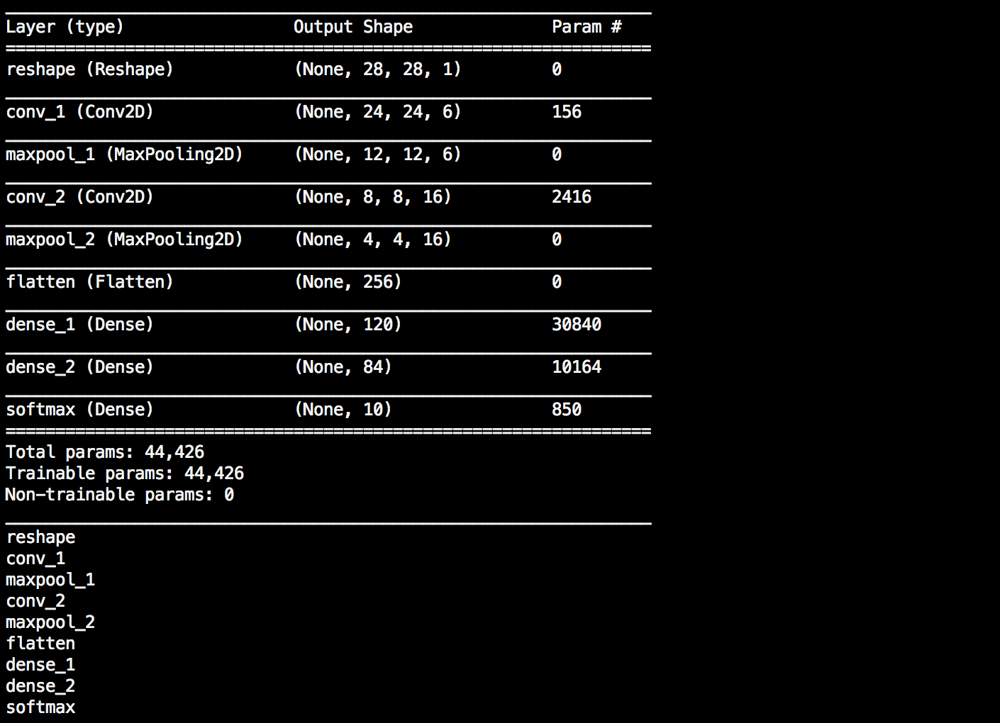
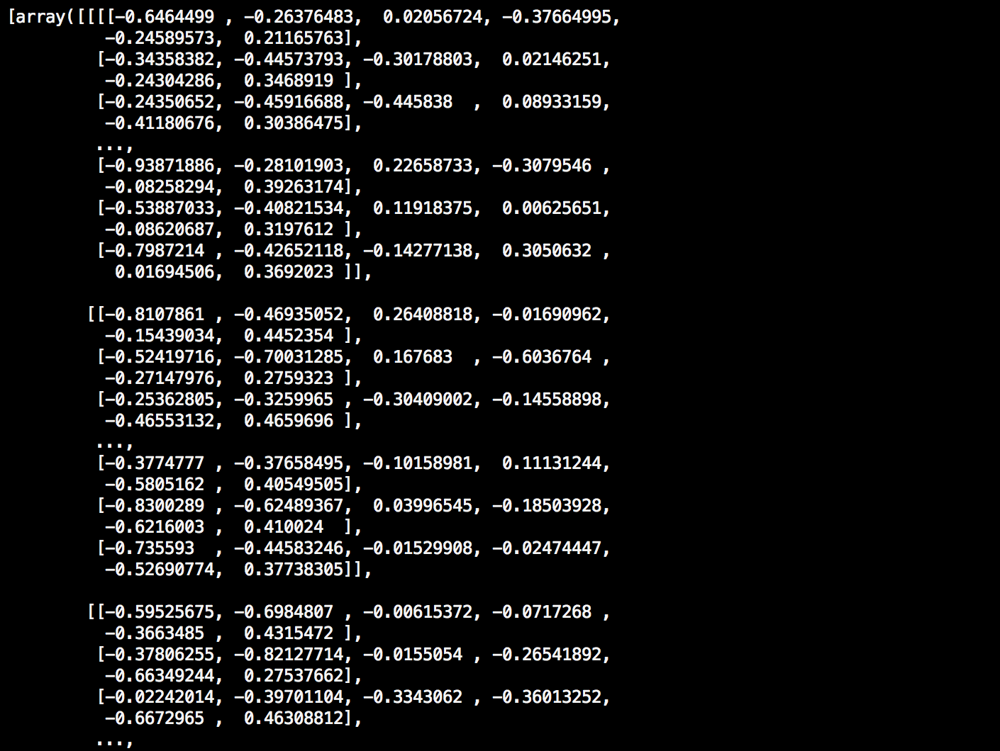

<p align="center">

</p>

# tf.keras 模型预处理

本篇将介绍如何预处理基于 tf.keras 搭建的神经网络模型，适配 TensorSpace 所需要的拥有中间层输出的模型。

以下为本篇教程所使用的代码及模型文件：
* [tf_keras_model.py](https://github.com/tensorspace-team/tensorspace/blob/master/docs/preprocess/tfKeras/src_py/tf_keras_model.py)
* [convert_tf_keras.sh](https://github.com/tensorspace-team/tensorspace/blob/master/docs/preprocess/tfKeras/src_sh/convert_tf_keras.sh)
* [模型](https://github.com/tensorspace-team/tensorspace/tree/master/docs/preprocess/tfKeras/models)

运行环境：Python 3.6.5。相关依赖如下：
```Python
import tensorflow as tf
import numpy as np
```

此外，我们还需要安装 [tfjs-converter](https://github.com/tensorflow/tfjs-converter) (基于 TensorFlow.js 的转换工具)：
```shell
$ pip install tensorflowjs
```

安装完成后，`tensorflowjs_converter`变为系统可用关键字，可用下列命令来调用：

```shell
$ tensorflowjs_converter \
    --input_format=tf_saved_model \
    --output_node_names=$onn \
    --saved_model_tags=serve \
    ../models/tensorflow_model \
    ../models/json_models/tensorflow
```

如果您在此之前没有任何基于 tf.keras 的经验，强烈建议先阅读由 TensorFlow 所撰写的[官方教程](https://www.tensorflow.org/guide/keras)。

预处理 tf.keras 模型，有以下几个步骤：
<p align="center">

<br/>
<b>图1</b> - 预处理 tf.keras 模型的步骤
</p>


* [1. 训练/加载模型](#loadModel)
* [2. 植入中间层输出](#addOutputs)
* [3. 保存嵌入后的模型](#saveModel)
* [4. 转换为 TensorSpace 适配的模型](#convertModel)

在本教程中，我们将使用 MNIST 数据集和 LeNet 神经网络结构来构筑一个 tf.keras 模型作为例子

## <div id="loadModel">1 训练/加载模型</div>

### 1.1 训练新模型

若没有可直接使用的 tf.keras 模型，可依照本小节的步骤创建一个新的 MNIST 手写识别的样例模型。

根据 LeNet 的网络结构：
<p align="center">

<br/>
<b>图2</b> - LeNet 网络结构
</p>


用以下代码迅速搭建其网络结构。

〔源码〕 [tf_keras_model.py](https://github.com/tensorspace-team/tensorspace/blob/master/docs/preprocess/tfKeras/src_py/tf_keras_model.py#L5)

```python
def create_sequential_model():
    single_output_model = tf.keras.models.Sequential([
            tf.keras.layers.InputLayer(input_shape=(28, 28)),
            tf.keras.layers.Reshape((28, 28, 1), input_shape=(28, 28,)),
            tf.keras.layers.Convolution2D(
                filters=6, kernel_size=5, strides=1, 
                input_shape=(28, 28, 1), name="conv_1"
            ),
            tf.keras.layers.MaxPool2D(
                pool_size=(2, 2), strides=(2, 2), name="maxpool_1"
            ),
            tf.keras.layers.Convolution2D(
                filters=16, kernel_size=5, strides=1, name="conv_2"
            ),
            tf.keras.layers.MaxPool2D(
                pool_size=(2, 2), strides=(2, 2), name="maxpool_2"
            ),
            tf.keras.layers.Flatten(),
            tf.keras.layers.Dense(120, activation=tf.nn.relu, name="dense_1"),
            tf.keras.layers.Dense(84, activation=tf.nn.relu, name="dense_2"),
            tf.keras.layers.Dense(10, activation=tf.nn.softmax, name="softmax")
        ])
    return single_output_model
```
**❗ 注意** 
* 为所有想展示的网络层均添加了 “**name**” 属性。

在完成网络结构的构建后，使用 MNIST 数据集训练模型。

〔源码〕 [tf_keras_model.py](https://github.com/tensorspace-team/tensorspace/blob/master/docs/preprocess/tfKeras/src_py/tf_keras_model.py#L45)
```python
mnist = tf.keras.datasets.mnist
(x_train, y_train),(x_test, y_test) = mnist.load_data()
x_train, x_test = x_train / 255.0, x_test / 255.0

model.compile(optimizer='adam',
              loss='sparse_categorical_crossentropy',
              metrics=['accuracy'])

model.fit(x_train, y_train, epochs=5)
```

训练完成后，得到一个具有完整结构及一定训练程度的 Keras 神经网络模型。通过以下代码查看结果是否正确。

〔源码〕 [tf_keras_model.py](https://github.com/tensorspace-team/tensorspace/blob/master/docs/preprocess/tfKeras/src_py/tf_keras_model.py#L107)
```python
input_sample = np.ndarray(shape=(28,28), buffer=np.random.rand(28,28))
input_sample = np.expand_dims(input_sample, axis=0)
print(model.predict(input_sample))
```

得到与下图相似的单一预测结果（一个长度为10的列表）：
<p align="center">

<br/>
<b>图3</b> - 新 Keras 模型的单一预测结果
</p>

#### 1.2 加载已有模型
如已有预训练模型，可使用以下代码来加载。

〔源码〕 [tf_keras_model.py](https://github.com/tensorspace-team/tensorspace/blob/master/docs/preprocess/tfKeras/src_py/tf_keras_model.py#L68)
```python
model = tf.keras.models.load_model(
    "PATH_TO_MODEL/model.h5",
    custom_objects=None,
    compile=True
)
```
或者该模型的**结构与权重为分开保存**，使用以下代码来加载。

〔源码〕 [tf_keras_model.py](https://github.com/tensorspace-team/tensorspace/blob/master/docs/preprocess/tfKeras/src_py/tf_keras_model.py#L75)
```python
json_path = "PATH_TO_JSON/model.json"
weight_path = "PATH_TO_WEIGHT/weights.hdf5"
structure = open(json_path, "r")
model = tf.keras.models.model_from_json(
    structure
)
model.load_weights(weight_path)
```

与完成创建新模型相似，加载后通过以下代码检测输出是否正确。〔源码〕 [tf_keras_model.py](https://github.com/tensorspace-team/tensorspace/blob/master/docs/preprocess/tfKeras/src_py/tf_keras_model.py#L107)
```python
input_sample = np.ndarray(shape=(28,28), buffer=np.random.rand(28,28))
input_sample = np.expand_dims(input_sample, axis=0)
print(model.predict(input_sample))
```

我们应当可以得到与下图相似的单一预测结果：
<p align="center">

<br/>
<b>图4</b> - 加载已有 Keras 模型得到的单一预测结果
</p>

**❗ 注意** 
* 由于我们使用随机数作为输入，因此输出也相对非常随机。

## <div id="addOutputs">2 添加中间层输出</div>
通过第一步，可得到 LeNet 的预测结果：1维数组，长度为10，每一位代表该序号所对应的概率。接下来获取中间层输出

首先，我们可以使用 `summary()` 方法得到中间层信息（layer.name）。当然，也可通过 layer 对象直接获取。

〔源码〕 [tf_keras_model.py](https://github.com/tensorspace-team/tensorspace/blob/master/docs/preprocess/tfKeras/src_py/tf_keras_model.py#L111)

```
model.summary()
for layer in model.layers:
     print(layer.name)
```

<p align="center">

<br/>
<b>图5</b> - 中间层信息输出
</p>

**❗ 注意** 

* 若在之前步骤中已设置了恰当的 `name` 属性，可以很迅速的找到其**名称及对应信息**。
* 若该模型为加载预训练模型得到，大多数情况下，中间层名称应与其所对应的类相关。

通过以下方法提取所需要的中间层，并将其添加到新创建的模型中。

〔源码〕 [tf_keras_model.py](https://github.com/tensorspace-team/tensorspace/blob/master/docs/preprocess/tfKeras/src_py/tf_keras_model.py#L116)
```python
output_layer_names = [
    "conv_1", "maxpool_1", "conv_2", "maxpool_2", 
    "dense_1", "dense_2", "softmax"
]
def generate_encapsulate_model_with_output_layer_names(model, output_layer_names):
    display_model = tf.keras.models.Model(
        inputs=model.input,
        outputs=list(map(lambda oln: model.get_layer(oln).output, output_layer_names))
    )
    return display_model
```

或者用以下方式添加所有中间层。

〔源码〕 [tf_keras_model.py](https://github.com/tensorspace-team/tensorspace/blob/master/docs/preprocess/tfKeras/src_py/tf_keras_model.py#L93)
```python
def generate_encapsulate_model(model):
    display_model = tf.keras.models.Model(
        inputs=model.input,
        # ignore 1st layer (input), since some old models do not have 1st layer as tf.layer
        outputs=list(map(lambda layer: layer.output, model.layers[1:]))
    )
    return display_model
```
**❗ 注意** 
* 请不要包括任何输入层（ 'input' 或是 `input_layer` ）。由于某些模型是由 `Model()` 构建，其输入部分并不是一个 tf.keras 层。
* 确认所需要的中间层并保证其顺序。

然后，可生成`嵌入多输出模型`。〔源码〕 [tf_keras_model.py](https://github.com/tensorspace-team/tensorspace/blob/master/docs/preprocess/tfKeras/src_py/tf_keras_model.py#L118)
```python
enc_model = generate_encapsulate_model_with_output_layer_names(model, output_layer_names)
# OR
# enc_model = generate_encapsulate_model(model)
```

可使用嵌入多输出模型进行预测
```python
print(enc_model.predict(input_sample))
```

<p align="center">

<br/>
<b>图6</b> - 经过预处理之后的中间层输出
</p>

最后一层的输出对应原模型的预测结果，它们是一致的。

<p align="center">

<br/>
<b>图7</b> - 最后一层的输出与原模型预测结果一致
</p>

新模型可以输出所有的你需要的层间数据。

## <div id="saveModel">3 保存嵌入后的多输出模型</div>

为了进一步转换模型，需保存嵌入后的多输出模型。

**❗ 注意** 

* 因为我们并不需要进一步训练，所以不需要编译嵌入的多输出模型。
* 若希望基于该嵌入后模型继续训练，可加入合适的损失和优化函数方法。这里我们以 “adam” 和 “sparse_categorical_crossentropy” 为例。

〔源码〕 [tf_keras_model.py](https://github.com/tensorspace-team/tensorspace/blob/master/docs/preprocess/tfKeras/src_py/tf_keras_model.py#L123)
```Python
enc_model.compile(optimizer='adam',
              loss='sparse_categorical_crossentropy',
              metrics=['accuracy'])
tf.keras.models.save_model(
    gen_dis_model,
    "/PATH_TO_NEW_MODEL/enc_model.h5",
    overwrite=True
)
```

## <div id="convertModel">4 转换为 TensorSpace 适配的模型</div>
最后一步将先前得到的嵌入的多输出模型转换为 TensorSpace 支持的模型。我们将会用到 [tfjs-converter](https://github.com/tensorflow/tfjs-converter)。

我们可以通过以下脚本来进行转换：
```shell
tensorflowjs_converter \
    --input_format=keras \
    ../models/enc_tf_keras_model.h5 \
    ../models/json_models/tf_keras
```

<p align="center">

<br/>
<b>图8</b> - 转换后所保存的最终模型文件
</p>

**❗ 注意**

* 得到两种类型的文件：
    * 一份 `model.json` 文件：包含所得到的模型结构信息（包括中间层输出）。
    * 一些权重文件：包含模型训练所得到的权重信息。权重文件的数量取决于模型的结构。
* 默认设置下，模型结构文件将命名为 "model.json"，**可修改其名称**。
* 权重文件都将以 "group1-shard1of1" 的格式命名并在 “model.json” 声明其关联性。因此，我们建议不要更改权重文件的名称。如有情况需要修改的，请妥善修改 “.json” (“model.json”) 中的关联信息。
* [点击链接](https://github.com/tensorflow/tfjs-converter)获取更多 tfjs-converter 的信息。

若至此一切顺利，可移步下一部分——[加载 TensorSpace 适配模型](http://tensorspace.org/html/docs/basicLoad_zh.html)。
