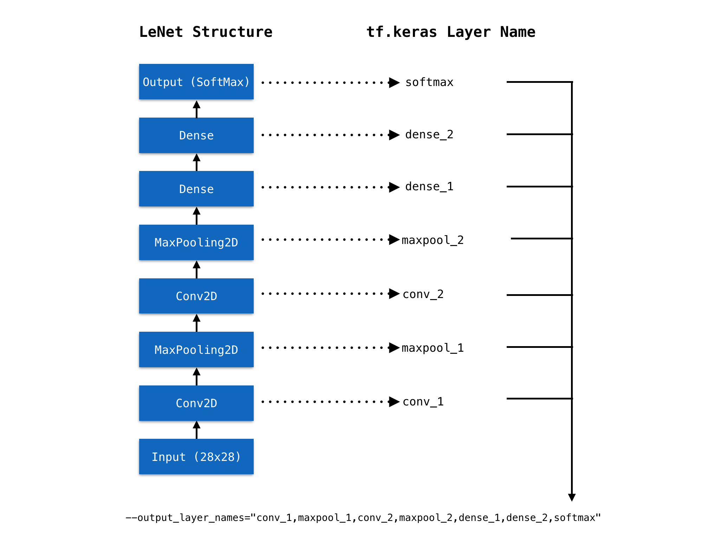
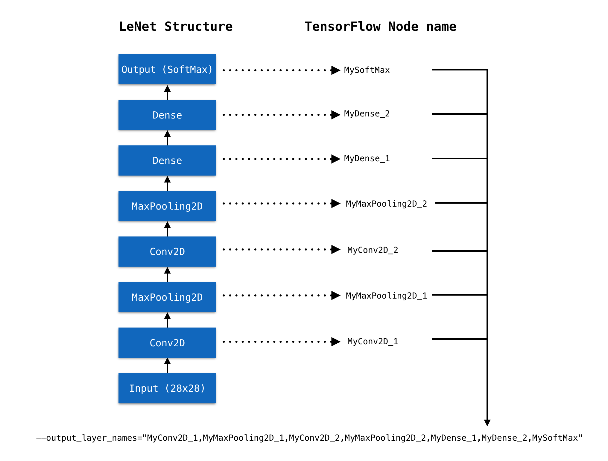
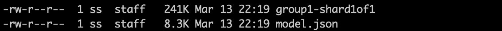

<p align="center">

</p>
<h1 align=center>TensorFlow</h1>
<p align=center><b>使用 TensorSpace 和 TensorSpace-Converter 可视化 TensorFlow 模型</b></p>

## 简介

本教程展示如何使用 TensorSpace 和 TensorSpace-Converter 可视化 TensorFlow 模型。在接下来的教程中，可视化使用 MNIST 数据集和 LeNet 神经网络结构 构建的 TensorFlow 模型。

我们提供了训练好的 `LeNet` 模型（多种格式），在可以直接从 [这里](https://github.com/tensorspace-team/tensorspace-converter/tree/master/examples/tensorflow/rawModel) 获得。

## 文件

以下为本篇教程所使用的代码及模型文件:

* [不同格式的 TensorFlow 模型文件](https://github.com/tensorspace-team/tensorspace-converter/tree/master/examples/tensorflow/rawModel)
    * [tf.keras 模型](https://github.com/tensorspace-team/tensorspace-converter/tree/master/examples/tensorflow/rawModel/keras)
    * [tf.keras 模型 (结构权重分开保存)](https://github.com/tensorspace-team/tensorspace-converter/tree/master/examples/tensorflow/rawModel/keras_separated)
    * [frozen 模型](https://github.com/tensorspace-team/tensorspace-converter/tree/master/examples/tensorflow/rawModel/frozen)
    * [saved 模型](https://github.com/tensorspace-team/tensorspace-converter/tree/master/examples/tensorflow/rawModel/saved)
* [TensorSpace-Converter 预处理脚本](https://github.com/tensorspace-team/tensorspace-converter/blob/master/examples/tensorflow/script)
* [TensorSpace 可视化代码](https://github.com/tensorspace-team/tensorspace-converter/blob/master/examples/tensorflow/index.html)

## 预处理

首先我们将会使用 TensorSpace-Converter 对不同格式的 `TensorFlow` 模型进行预处理。

### tf.keras 模型

* 对于模型结构和权重合并保存的 `tf.keras` 模型，会有一个 `xxx.h5` 文件。可以使用以下 TensorSpace-Converter 脚本进行转化：

```shell
$ tensorspacejs_converter \
      --input_model_from="tensorflow" \
      --input_model_format="tf_keras" \
      --output_layer_names="conv_1,maxpool_1,conv_2,maxpool_2,dense_1,dense_2,softmax" \
      ./rawModel/keras/tf_keras_model.h5 \
      ./convertedModel/layerModel
```

**❗ 注意:** 

* 将 `input_model_from` 设置成 `tensorflow`。
* 将 `input_model_format` 设置成 `tf_keras`。
* 将 `.h5` 文件的路径设置到 `input_path` 中。
* 取出 `tf.keras` 模型的 `Layer` 名称, 然后设置到 `output_layer_names` 中，如 `图1` 所示。
* 以上 TensorSpace-Converter 预处理脚本将会在 `convertedModel/layerModel` 文件夹中生成经过预处理的模型。在本教程中，我们已经生成了经过预处理的模型，模型文件可以在 [这个文件夹](https://github.com/tensorspace-team/tensorspace-converter/tree/master/examples/tensorflow/convertedModel/layerModel) 中找到。

### tf.keras 模型 (结构权重分开保存)

* 对于模型结构和权重分开保存的 `tf.keras` 模型，会有一个模型结构文件 `xxx.json` 和一个权重文件 `eee.h5`。可以使用以下 TensorSpace-Converter 脚本进行转化：

```shell
$ tensorspacejs_converter \
      --input_model_from="tensorflow" \
      --input_model_format="tf_keras_separated" \
      --output_layer_names="Conv2D_1,MaxPooling2D_1,Conv2D_2,MaxPooling2D_2,Dense_1,Dense_2,Softmax" \
      ./rawModel/keras_separated/topology.json,./rawModel/keras_separated/weights.h5 \
      ./convertedModel/layerModel
```

**❗ 注意:** 

* 将 `input_model_from` 设置成 `tensorflow`。
* 将 `input_model_format` 设置成 `tf_keras_separated`。
* 对于这种模型类型，因为有两个模型文件，在设置 `TensorSpace-Converter` 的 `input_path` 时，合并两个文件的路径，并用英文半角逗号“,”分开，将 `.json` 文件的路径在前，`.h5` 文件的路径在后。
* 取出 `tf.keras` 模型的 `Layer` 名称, 然后设置到 `output_layer_names` 中，如 `图1` 所示。
* 以上 TensorSpace-Converter 预处理脚本将会在 `convertedModel/layerModel` 文件夹中生成经过预处理的模型。在本教程中，我们已经生成了经过预处理的模型，模型文件可以在 [这个文件夹](https://github.com/tensorspace-team/tensorspace-converter/tree/master/examples/tensorflow/convertedModel/layerModel) 中找到。

### frozen 模型

* 对于 TensorFlow frozen 模型。可以使用以下 TensorSpace-Converter 脚本进行转化：

```shell
$ tensorspacejs_converter \
      --input_model_from="tensorflow" \
      --input_model_format="tf_frozen" \
      --output_layer_names="MyConv2D_1,MyMaxPooling2D_1,MyConv2D_2,MyMaxPooling2D_2,MyDense_1,MyDense_2,MySoftMax" \
      ./rawModel/frozen/frozen_model.pb \
      ./convertedModel/graphModel
```

**❗ 注意:** 

* 将 `input_model_from` 设置成 `tensorflow`。
* 将 `input_model_format` 设置成 `tf_frozen`。
* 将 `.pb` 文件的路径设置到 `input_path` 中。
* 取出 `frozen` 模型的 `node` 名称, 然后设置到 `output_layer_names` 中，如 `图2` 所示。
* 以上 TensorSpace-Converter 预处理脚本将会在 `convertedModel/graphModel` 文件夹中生成经过预处理的模型。在本教程中，我们已经生成了经过预处理的模型，模型文件可以在 [这个文件夹](https://github.com/tensorspace-team/tensorspace-converter/tree/master/examples/tensorflow/convertedModel/graphModel) 中找到。

### saved 模型

* 对于 TensorFlow saved 模型。可以使用以下 TensorSpace-Converter 脚本进行转化：

```shell
$ tensorspacejs_converter \
      --input_model_from="tensorflow" \
      --input_model_format="tf_saved" \
      --output_layer_names="MyConv2D_1,MyMaxPooling2D_1,MyConv2D_2,MyMaxPooling2D_2,MyDense_1,MyDense_2,MySoftMax" \
      ./rawModel/saved \
      ./convertedModel/graphModel
```

**❗ 注意:** 

* 将 `input_model_from` 设置成 `tensorflow`。
* 将 `input_model_format` 设置成 `tf_saved`。
* 将 saved 模型文件夹路径设置到 `input_path` 中。
* 取出 `frozen` 模型的 `node` 名称, 然后设置到 `output_layer_names` 中，如 `图2` 所示。
* 以上 TensorSpace-Converter 预处理脚本将会在 `convertedModel/graphModel` 文件夹中生成经过预处理的模型。在本教程中，我们已经生成了经过预处理的模型，模型文件可以在 [这个文件夹](https://github.com/tensorspace-team/tensorspace-converter/tree/master/examples/tensorflow/convertedModel/graphModel) 中找到。


<p align="center">

<br/>
<b>图1</b> - 将 tf.keras 模型 Layer 名取出并设置 output_layer_names
</p>

<p align="center">

<br/>
<b>图2</b> - 将 TensorFlow 模型 node 名取出并设置 output_layer_names
</p>

经过转化后，我们将会得到经过预处理的模型：
<p align="center">

<br/>
<b>图3</b> - 经过预处理的 TensorFlow 模型
</p>

**❗ 注意:** 

* 我们将会得到2种不同类型的文件：
    * 一份 `model.json` 文件：包含所得到的模型结构信息（包括中间层输出）。
    * 一些 `权重` 文件：包含模型训练所得到的权重信息。权重文件的数量取决于模型的结构。

## 载入并可视化

通过 TensorSpace API 构建 TensorSpace 可视化模型。
```javascript
let model = new TSP.models.Sequential( modelContainer );

model.add( new TSP.layers.GreyscaleInput() );
model.add( new TSP.layers.Conv2d() );
model.add( new TSP.layers.Pooling2d() );
model.add( new TSP.layers.Conv2d() );
model.add( new TSP.layers.Pooling2d() );
model.add( new TSP.layers.Dense() );
model.add( new TSP.layers.Dense() );
model.add( new TSP.layers.Output1d( {
    outputs: [ "0", "1", "2", "3", "4", "5", "6", "7", "8", "9" ]
} ) );
```

TensorSpace 在载入模型时，对于不同种类的 TensorFlow 模型，需要进行不同的配置。

对于 TensorSpace-Converter 生成的 layer 模型 (tf.keras 模型)：
```javascript
model.load( {
    type: "tensorflow",
    url: "./convertedModel/layerModel/model.json"
} );
```

对于 TensorSpace-Converter 生成的 graph 模型 (tfrozen 模型或者 saved 模型)，需要配置 TensorSpace Loader 的 `outputsName` 属性，属性中的`name` 和在使用TensorSpace-Converter 转化时输入的 `output_layer_names` 相同：

```javascript
model.load( {
    type: "tensorflow",
    url: "./convertedModel/graphModel/model.json",
    outputsName: ["MyConv2D_1", "MyMaxPooling2D_1", "MyConv2D_2", "MyMaxPooling2D_2", "MyDense_1", "MyDense_2", "MySoftMax"]
} );
```

然后将 TensorSpace 模型进行初始化：
```javascript
model.init();
```

## 结果显示

若至此一切顺利，在浏览器中打开 `index.html`，将会看到以下模型：
<p align="center">

<br/>
<b>图4</b> - TensorSpace LeNet 预测 "5"
</p>
