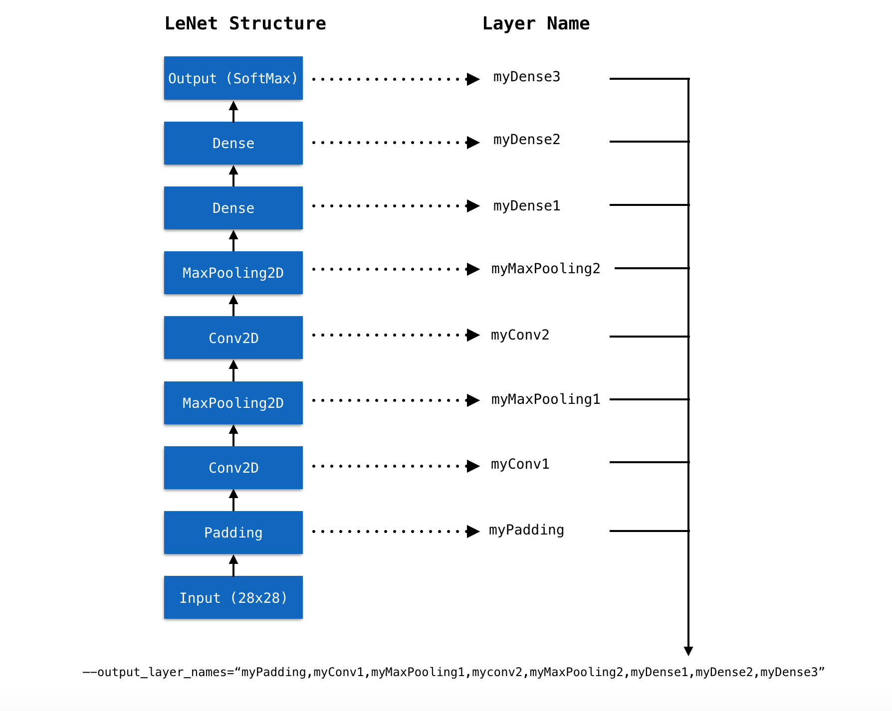
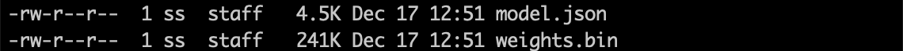

<p align="center">

</p>
<h1 align=center>TensorFlow.js</h1>
<p align=center><b>Visualize pre-trained TensorFlow.js model using TensorSpace and TensorSpace-Converter</b></p>

## Introduction

In the following chapter, we will introduce the usage and workflow of visualizing TensorFlow.js model using TensorSpace and TensorSpace-Converter. In this tutorial, we will convert a TensorFlow.js model with TensorSpace-Converter and visualize the converted model with TensorSpace.

This example uses LeNet trained with MNIST dataset. If you do not have any existed model in hands, you can use this <a href="https://github.com/tensorspace-team/tensorspace-converter/blob/master/examples/tfjs/train/createModel.html">script</a> to train a LeNet TensorFlow.js model. We also provide [pre-trained LeNet model](https://github.com/tensorspace-team/tensorspace-converter/tree/master/examples/tfjs/rawModel) for this example.

## Sample files

The sample files that are used in this tutorial are listed below:

* pre-trained TensorFlow.js model ([mnist.json](https://github.com/tensorspace-team/tensorspace-converter/blob/master/examples/tfjs/rawModel/mnist.json) and [mnist.weight.bin](https://github.com/tensorspace-team/tensorspace-converter/blob/master/examples/tfjs/rawModel/mnist.weights.bin))
* [TensorSpace-Converter preprocess script](https://github.com/tensorspace-team/tensorspace-converter/blob/master/examples/tfjs/script/converter.sh)
* [TensorSpace visualization code](https://github.com/tensorspace-team/tensorspace-converter/blob/master/examples/tfjs/index.html)

## Preprocess

First we will use TensorSpace-Converter to preprocess pre-trained TensorFlow.js model:

```shell
$ tensorspace_converter \
    --input_model_from="tfjs" \
    --output_layer_names="myPadding,myConv1,myMaxPooling1,myConv2,myMaxPooling2,myDense1,myDense2,myDense3" \
    ./rawModel/mnist.json \
    ./convertedModel/
```

**Note:**

* Set `input_model_from` to be `tfjs`.
* A pre-trained model built by TensorFlow.js, may have a topology file `xxx.json` and a weights file `xxx.weight.bin`, the two files should be put in the same folder and set topology file's path to positional argument `input_path`.
* Get out the layer names of model, and set to `output_layer_names` like `Fig. 1`.
* TensorSpace-Converter will generate preprocessed model into `convertedModel` folder, for tutorial propose, we have already generated a model which can be found in [this folder](https://github.com/tensorspace-team/tensorspace-converter/tree/master/examples/tfjs/convertedModel).

<p align="center">

<br/>
<b>Fig. 1</b> - Set TensorFlow.js layer names to output_layer_names
</p>

After converting, we shall have the following preprocessed model:
<p align="center">

<br/>
<b>Fig. 2</b> - Preprocessed TensorFlow.js model
</p>

**Note:**

* There are two types of files created:
  * `.json` is for the model structure
  * `.bin` is the trained weights

## Load and Visualize

Then Apply TensorSpace API to construct visualization model.
```javascript
let model = new TSP.models.Sequential( modelContainer );

model.add( new TSP.layers.GreyscaleInput() );
model.add( new TSP.layers.Padding2d() );
model.add( new TSP.layers.Conv2d() );
model.add( new TSP.layers.Pooling2d() );
model.add( new TSP.layers.Conv2d() );
model.add( new TSP.layers.Pooling2d() );
model.add( new TSP.layers.Dense() );
model.add( new TSP.layers.Dense() );
model.add( new TSP.layers.Output1d( {
    outputs: [ "0", "1", "2", "3", "4", "5", "6", "7", "8", "9" ]
} ) );
```

Load the model generated by TensorSpace-Converter and then initialize the TensorSpace visualization model:
```javascript
model.load( {
    type: "tfjs",
    url: "./convertedModel/model.json"
} );

model.init();
```

## Result

If everything goes well, open the `index.html` file in browser, the model will display in the browser:
<p align="center">

<br/>
<b>Fig. 3</b> - TensorSpace LeNet with prediction data "5"
</p>